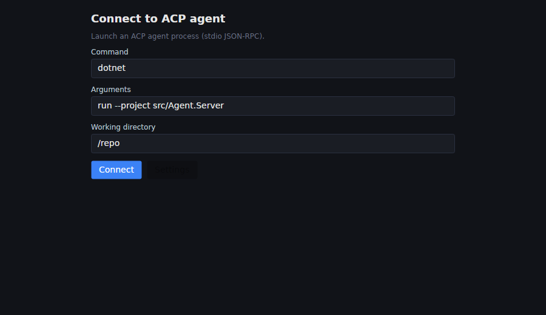
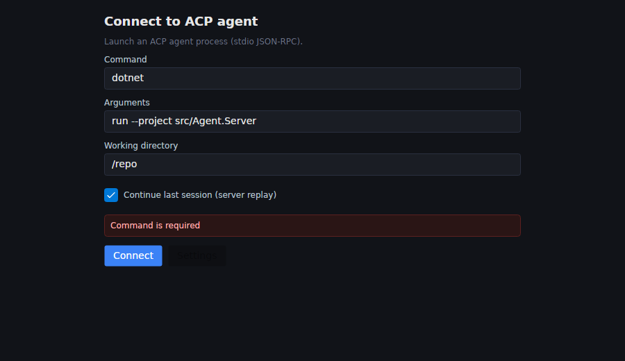
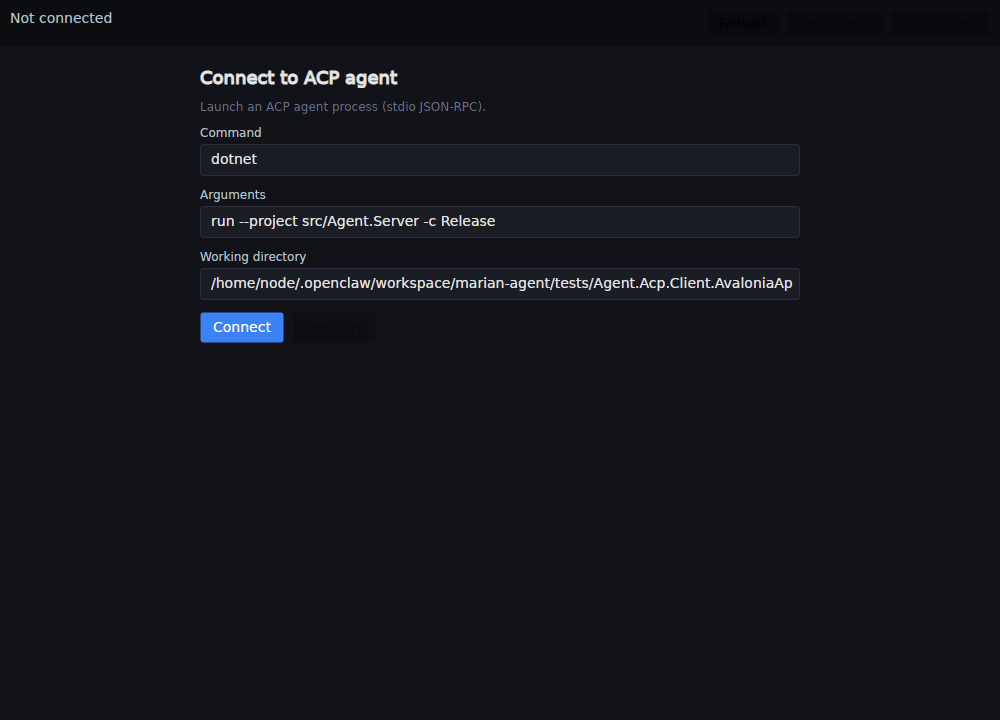
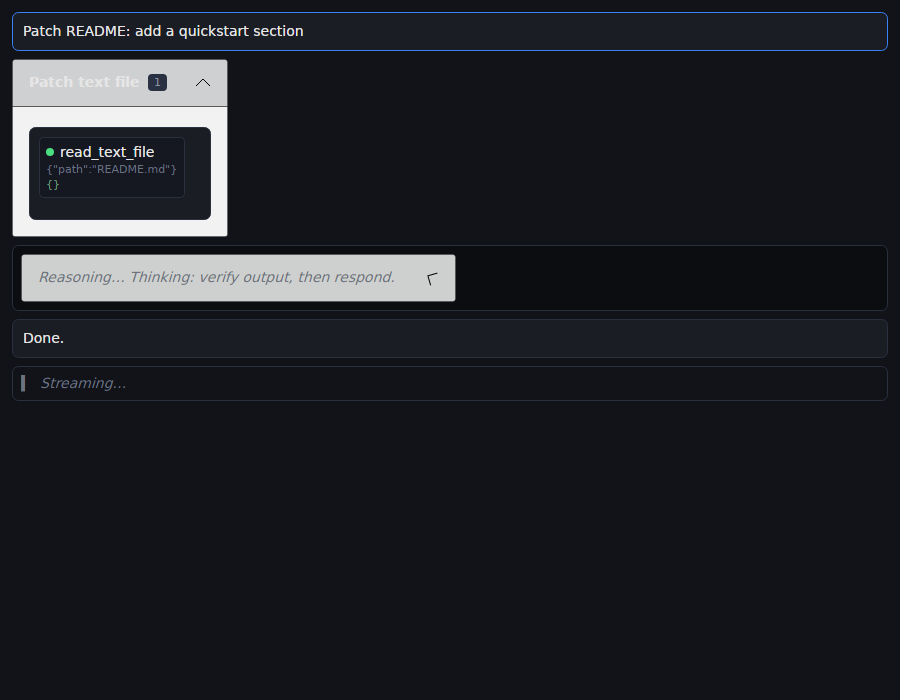

# ACP Client (Avalonia) — UX & Interaction Design

This document describes the intended UX for the **Agent.Acp.Client.AvaloniaApp** desktop client.

Goals:
- Work with **any ACP agent** (generic protocol client)
- Provide **enhanced rendering** for Marian’s agent:
  - **Group tool calls by reported intent**
  - Render each intent as a **collapsible section**

---

## Screens

### 1) Connect

**Purpose:** connect to an ACP agent endpoint.

**Primary controls**
- Endpoint URL (required)
- API key / token (optional)
- Recent connections list (quick connect + delete)

**Primary action:** Connect

**Notes (implementation)**
- ViewModel: `ConnectionViewModel`
- Persist recent connections (file-based or user settings)
- Default spawn target: `dotnet run --project src/Agent.Server -c Release`

---

### 2) Chat (Main Workspace)

**Layout**
- Left: conversations list + New Chat
- Center: transcript (messages)
- Bottom: composer (multi-line input + send)

**Generic ACP support**
- Render message stream from agent
- Render tool calls as timeline items when no intent grouping is available

**Enhanced support (Marian’s agent)**
- Tool calls are grouped into intent “buckets” (see next section)

---

## Intent-grouped tool calls (enhanced rendering)

When the agent reports an **intent** for a set of tool calls, the UI renders:
- An `Expander` header titled with the intent
- Tool count
- Aggregated completion status
- Tool rows with status indicators (running/success/error)

### Screenshots (generated by headless UI tests)

Connect screen:

Connect screen (error state):

Shell (connection state):

Shell (chat state):

Composer:

Composer (error):

Chat sample (intent group + tools + assistant text):

Intent group (expanded):

Intent group (collapsed):

> These PNGs are generated by `IntentGroupViewScreenshotTests` into `docs/ux/screens/`.

---

## Transport (current)

### Live session updates

The client expects agents to send streaming notifications:
- JSON-RPC notification: `method = "session/update"`
- `params = { sessionId, update }`

Implementation:
- `AcpSessionUpdatePump` parses notifications and applies the `update` as an ACP `SessionUpdate` union.

### stdio-only (current)

At this stage the Avalonia client supports **stdio** only:
- The client starts an ACP agent process (`ProcessStartInfo`) and connects using
  newline-delimited JSON-RPC over stdio.

Implementation:
- `StdioAcpAgentProcess`
- `LineDelimitedStreamTransport`
- `AcpClientConnection`

Covered by TDD (integration-style test using `samples/Acp.MinimalAgent`):
- `StdioAcpAgentProcessTests`

---

## Tool call detail (drill-in)

Clicking a tool call should show:
- Tool name
- Arguments (formatted)
- Output (truncated w/ expand)
- Duration + status
- Copy buttons

Implementation suggestion:
- `Flyout` or right-side panel (SplitView)

---

## Settings

Suggested toggles
- Theme (Light/Dark/System)
- Font size
- Compact mode
- Tool display:
  - Auto-collapse completed intent groups
  - Show tool output previews

---

## TDD + UX workflow

We use screenshot tests to keep UX changes intentional:
1. Add/modify a view/viewmodel
2. Add/update a headless screenshot test
3. Commit the updated PNGs alongside code

This ensures UI work stays reviewable in PRs even without running the desktop app.
